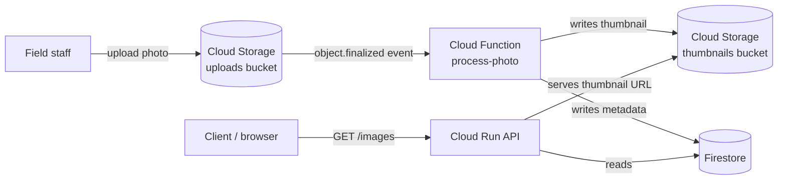

# Photo Pipeline

**Day 1 project — event-driven architecture on GCP (Always Free tier)**

## The ask

> "Field staff upload photos. We want thumbnails generated automatically and
> a way to see what's been processed — without anyone manually running a script."

## Architecture

## Why these pieces

| Component | Why this, not something else |
|---|---|
| **Cloud Storage (uploads)** | Durable, cheap object storage; natively emits events on upload — no polling needed |
| **Cloud Function (event-driven)** | Runs only when a file actually lands — pay-per-invocation, scales to zero, no idle server |
| **Cloud Storage (thumbnails)** | Separate bucket from uploads so read access can be public/scoped independently from raw uploads |
| **Firestore** | Same reasoning as Day 0: managed, free-tier friendly, no server to run |
| **Cloud Run (API)** | Same reasoning as Day 0: public read API, scales to zero |

## Why *not* other options (trade-offs considered)

- **Polling instead of event trigger** — would need a cron job constantly checking for new files; wasteful and slower. Event triggers are the correct default whenever "something happened" should cause "do a thing."
- **One bucket for uploads and thumbnails** — simpler, but conflates raw (potentially sensitive/unprocessed) uploads with public-facing derived assets. Separating them is a common real-world pattern for access control.
- **Processing inside the Cloud Run API itself** (upload directly to the API) — couples upload and processing into one request/response cycle, so a slow thumbnail job would make the client wait. Event-driven decouples them.

## IAM design (least privilege)

- `process-photo` function's service account: read on uploads bucket, write on thumbnails bucket, write on Firestore `images` collection — nothing else.
- API's service account: read-only on Firestore `images` collection — nothing else.

## Cost

All services used are within GCP's Always Free tier for this scale of usage:
Cloud Functions (2M invocations/month free), Cloud Storage (5GB free), Firestore (1GB + daily read/write quota free), Cloud Run (2M requests/month free).

## Status

- [ ] Cloud Function: generate thumbnail + write metadata
- [ ] Cloud Run API: list processed images
- [ ] Terraform: provision all infra
- [ ] End-to-end test: upload → thumbnail appears → API returns it
- [ ] Teardown
